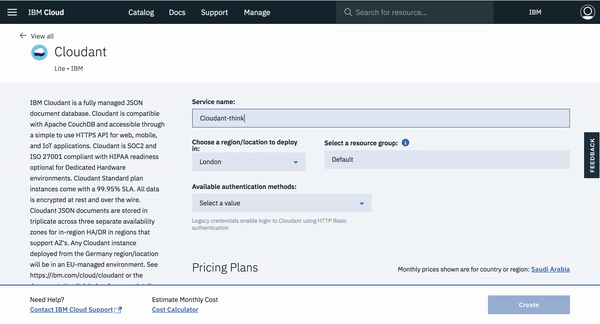
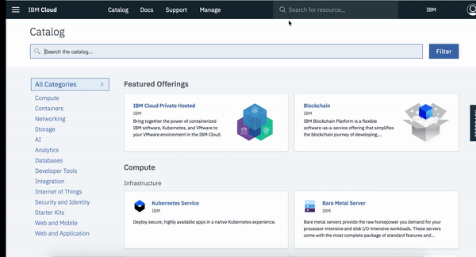
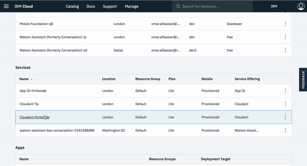
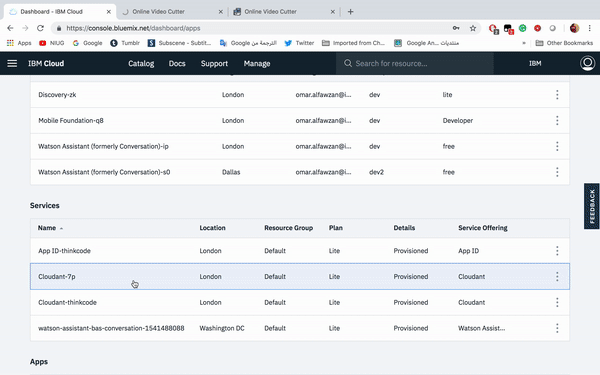
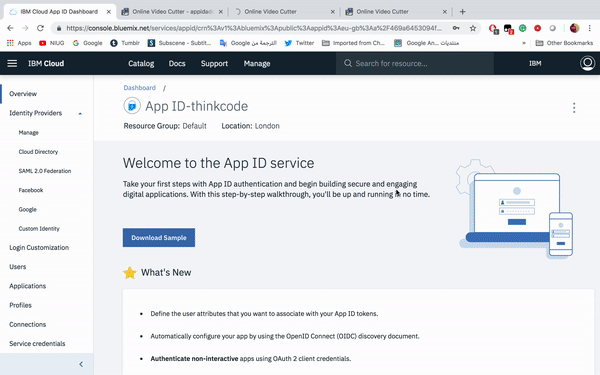
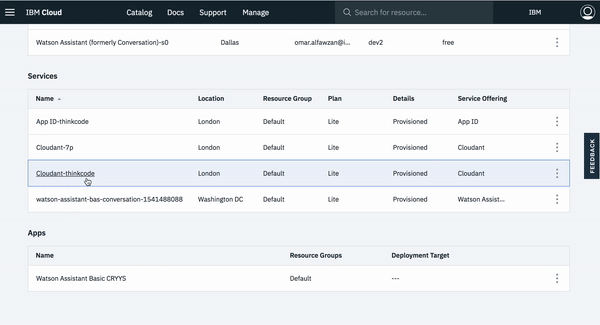
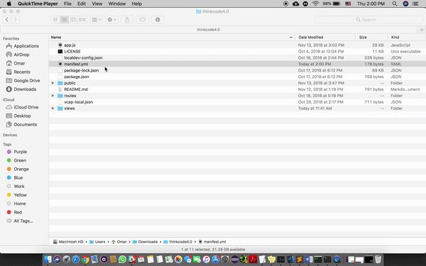
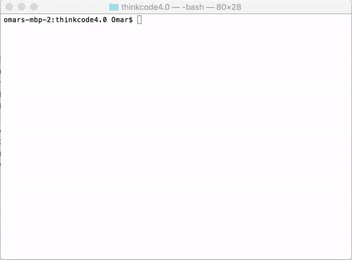
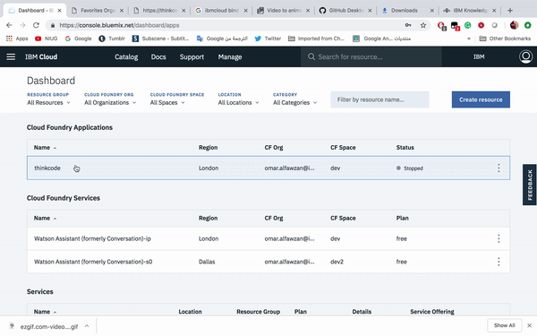
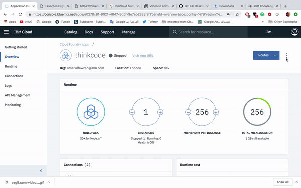

# Think-Code-Deliver

## Introduction
DevOps is IBM’s methodology to create an app from the design phase to the maintenance phase. In this tutorial, you will be taught the design thinking methodology of IBM, then we will learn more about IBM cloud and its services. Finally, you will be able to deploy your app to the cloud. 

## Prerequisites
* [IBM Cloud](https://ibm.biz/thinkcodedeliver "IBM Cloud")
* [IBM Cloud CLI](https://ibm.biz/ibmcloudcli "IBM Cloud CLI")
* [Node.js npm](https://nodejs.org/en "Node.js")

## Design Thinking
It's a framework to solve problems at the speed and scale of the modern enterprise. Whether you’re re-envisioning the customer experience for a multinational bank or planning your product’s next release, Design Thinking keeps you focused on what matters to users as you lead your team from ideas to outcomes. Design Thinking is a modern methodology to try and find solutions to everyday problems. It gives you the chance to be in the shoes of your customers, clients or marketed segment.

## Architecture

1. User opens the app 
2. User sign in 
3. App ID service checks and validates the user
4. After authenticating the user can access the app
5. Retrieve data and upload it to Cloudant 

## Lab Steps
### 1. Clone or Download the github file
### 2. Create [Cloudant](https://console.bluemix.net/catalog/services/cloudant "Cloudant service") service

### 3. Create [App ID](https://console.bluemix.net/catalog/services/appid "App ID service") service

### 4. To run locally
   #### 4.1. Copy credentials of your Cloudant service
   
   
   #### 4.2. Copy credentials of your App Id service
   
   #### 4.3. Open App ID and add your own URL after going to **Manage > Authentication Settings**
   
   #### 4.4. Run the App
### 5. To run in IBM Cloud
   #### 5.1. Open manifest and add the name and the service of App ID and Cloudant
   
   #### 5.2. Login to IBM Cloud via terminal then choose the right APi
   #### 5.3. Push the App to IBM Cloud
   
   #### 5.4. From Cloud Foundray create connection App ID and Cloudant, then stop the app
   
   #### 5.5. Copy your URL and add it to App ID
   
   #### 5.6. Now you're app is deployed and you can start using it

